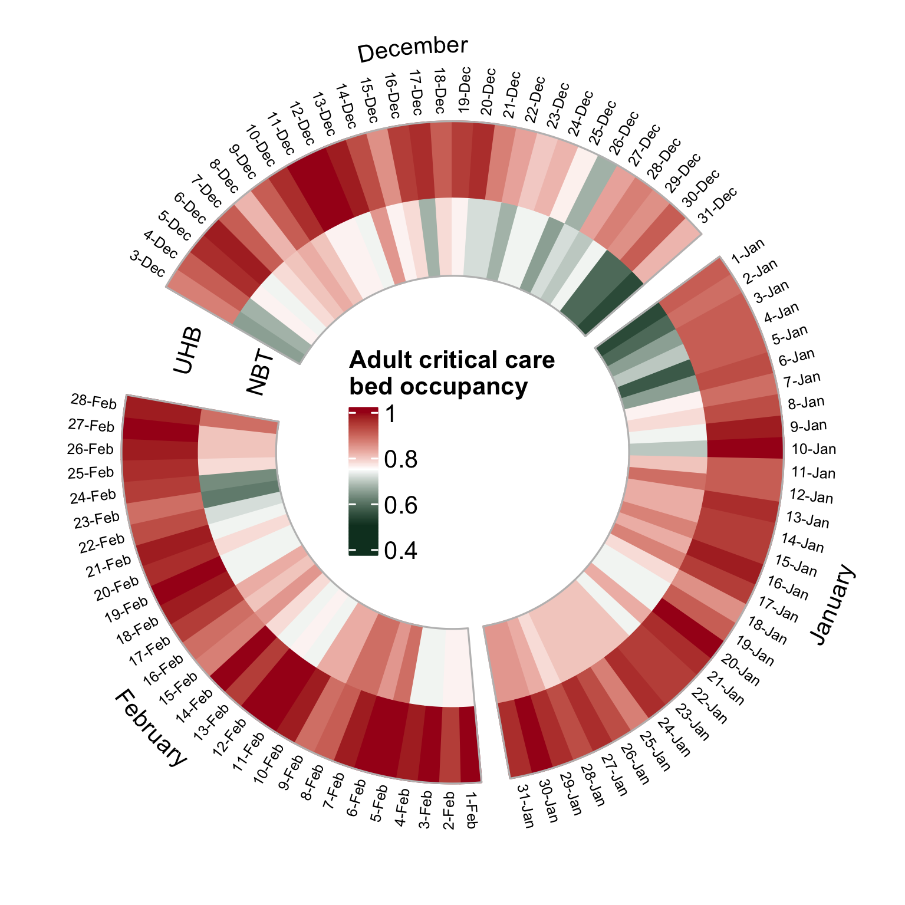

## Winter critical care hospital occupancy in Bristol for adults, children, and infants (2018-2019, pre-COVID)

Challenge details: [https://github.com/MRCIEU/P4winter-viz-challenge](https://github.com/MRCIEU/P4winter-viz-challenge)

Data from NHS England: [Winter SitRep: Acute Time series 3 December 2018 to 3 March 2019 (XLSX, 1480kB)](https://www.england.nhs.uk/statistics/statistical-work-areas/winter-daily-sitreps/winter-daily-sitrep-2018-19-data/)

Visualisation tools: R packages **circilize** ([https://github.com/jokergoo/circlize](https://github.com/jokergoo/circlize)) and **ComplexHeatmap** (Bioconductor)

---

All files (`.Rmd` / `.html` / `.ipynb`) have the same contents and fully explain the analysis and visualisation. This README includes text and images from the analysis.

`.ipyth` was generated from `.Rmd` to simplify viewing on Github, but for the best experience, please view `.html`. To reproduce the analysis, run it from `.Rmd`. 

---

### Background

The dataset contains critical care bed occupancy in all NHS Trusts across England from December 2018 to February 2019 (pre-COVID data). 

In this analysis/visualisation, I will focus on Bristol data only. Hospitals in Bristol are split between two NHS Trusts - _North Bristol NHS Trust_ and _University Hospitals Bristol and Weston NHS Foundation Trust_, which cover the north and centre/south of the city, respectively. For context, below is the list of hospitals that belong to the two trusts [[source](https://en.wikipedia.org/wiki/Healthcare_in_Bristol)]:

North Bristol NHS Trust  (**NBT**) manages hospitals in the north of Bristol and South Gloucestershire.

- Southmead Hospital
- Cossham Memorial Hospital
- Frenchay Hospital

University Hospitals Bristol and Weston NHS Foundation Trust (**UHB**) manages hospitals in the centre and south of the city, and at Weston-super-Mare.

- Bristol Royal Infirmary (BRI)
- Bristol Heart Institute
- Bristol Haematology and Oncology Centre
- South Bristol Community Hospital
- Bristol Royal Hospital for Children 
- St. Michael's Hospital
- Bristol Eye Hospital
- University of Bristol Dental Hospital

### Analysis

We are going to look at critical care bed occupancy for adults, children (<14 years), and infants (<6 months) in these two Bristol-based NHS Trusts (NBT & UHB), and visualise how occupancy changed over the winter months (especially during the holidays period! :christmas_tree: )

#### Adult critical care

 - UBH (n_beds=55) was very busy during the entire winter season (mean occupancy 93%) 
 - The only days with occupancy < 80% at UHB were Christmas and Boxing Days :santa: :gift:
 - NBT (n_beds=46) was busy too (mean occupancy 76%), but there were fewer people in critical care in NBT over the entire holiday season (~ 20-Dec to 6-Jan) :christmas_tree:)

#### Paediatric intensive care

Children (< 14 years)

- Paediatric intensive care in Bristol is only available at UHB (likely at the _Bristol Royal Hospital for Children_), with mean occupancy 65%
- Therefore, no data is presented for NBT in the plot
- There was quite "low" bed occupancy in the paediatric unit between 25-Dec and 7-Jan: < 50% :gift: :christmas_tree: :santa:

### Neonatal intensive care (NICU)

Infants (< 6 months)

- NBT and UHB have a similar number of NICU beds (30/31)
- NBT was busier (92% mean occupancy), with 100% beds taken from 24-Dec to 23-Jan
- At UHB a smaller number of beds were occupied from 24-Dec to 5-Jan :gift:

 

#### Final thoughts

- Critical care bed occupancy was high during the winter season pre-Covid
- High occupancy in neonatal intensive care may not be winter-season related
- Overall, there were less adults and children in critical care over the holiday season :gift: :christmas_tree: :santa:

 

